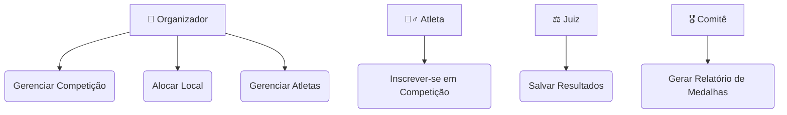
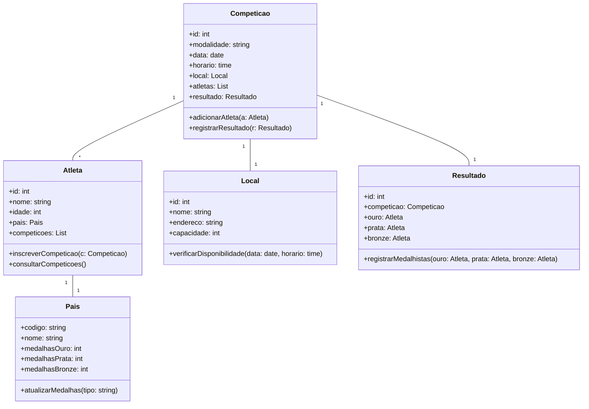
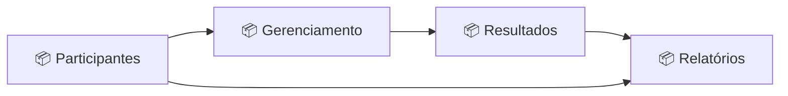
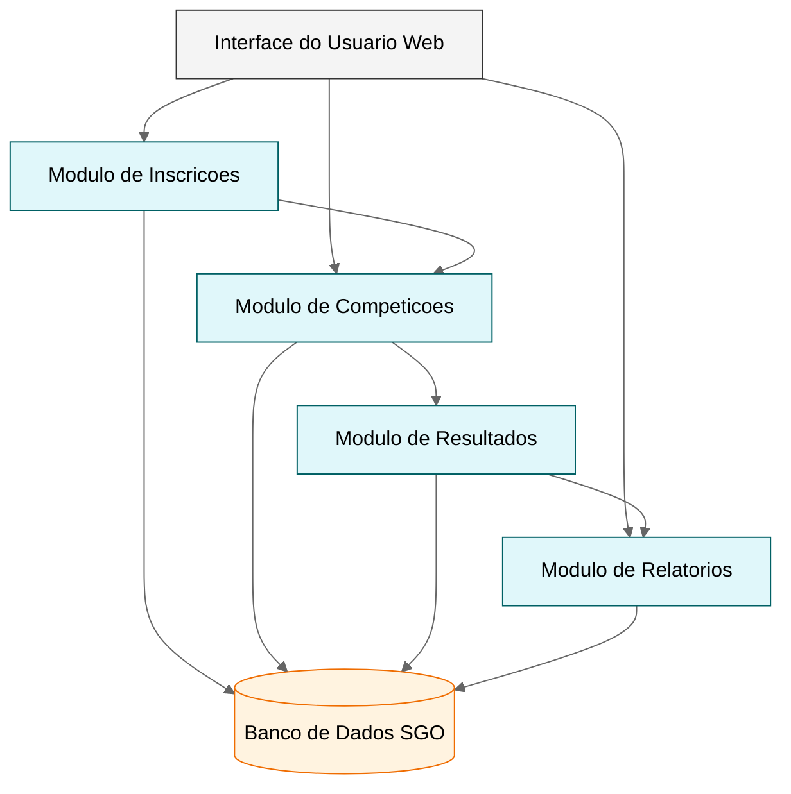
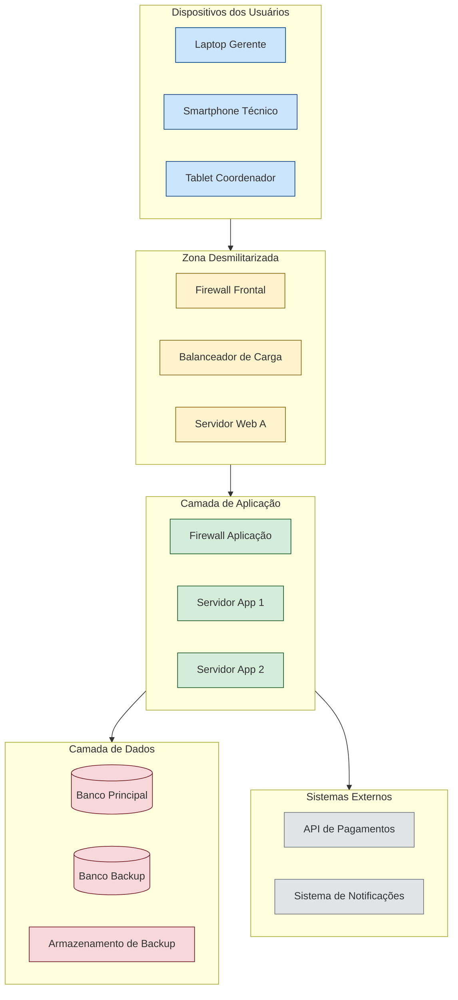

# Sistema-de-Gestao-das-Olimpiadas-SGO-

# 🏅 Sistema de Gestão das Olimpíadas (SGO)

## 📘 Descrição do Sistema
O **Sistema de Gestão das Olimpíadas (SGO)** tem como objetivo gerenciar competições, inscrições de atletas, alocação de locais, controle de resultados e geração de relatórios de medalhas.  

O sistema permite:
- Cadastrar competições e seus detalhes;
- Inscrever atletas representando países;
- Alocar locais de forma a evitar conflitos de horário;
- Registrar resultados e gerar relatórios de medalhas por país.

---

## 👥 Histórias de Usuário

**US01 — Cadastrar Competição**  
> Como organizador, quero cadastrar novas competições com nome, modalidade, data, horário e local, para que sejam incluídas no cronograma oficial.

**US02 — Inscrever Atleta**  
> Como atleta, quero me inscrever em uma competição específica representando meu país, para participar oficialmente dos jogos.

**US03 — Alocar Local**  
> Como administrador, quero alocar locais para cada competição sem sobreposição de horários, garantindo o uso adequado das instalações.

**US04 — Registrar Resultados**  
> Como juiz, quero registrar os vencedores e classificados de cada competição, para atualizar o quadro de medalhas.

**US05 — Gerar Relatório de Medalhas**  
> Como comitê organizador, quero visualizar o total de medalhas de cada país (ouro, prata e bronze), para divulgar os resultados oficiais.

---

##  Diagrama de Caso de Uso 

---

##  Diagrama de Classes e de Pacotes 

---

---

## Diagrama de Componentes

---

## Diagrama de Implantação

