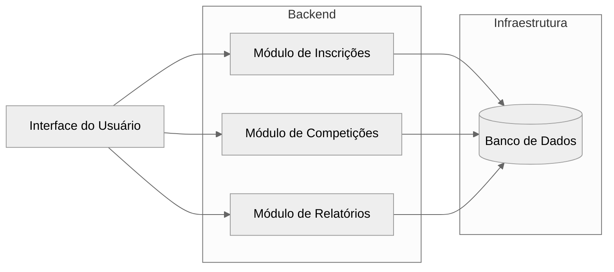
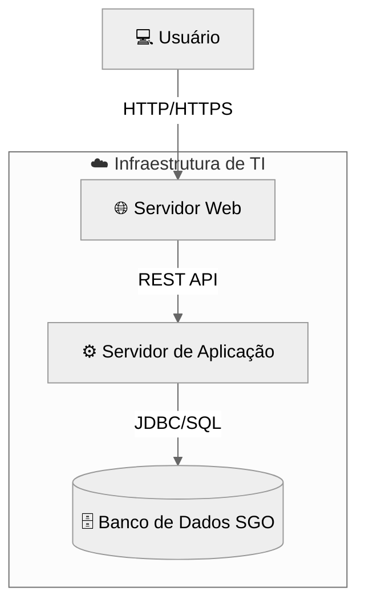

# Sistema-de-Gestao-das-Olimpiadas-SGO-

# 🏅 Sistema de Gestão das Olimpíadas (SGO)

## 📘 Descrição do Sistema
O **Sistema de Gestão das Olimpíadas (SGO)** tem como objetivo gerenciar competições, inscrições de atletas, alocação de locais, controle de resultados e geração de relatórios de medalhas.  

O sistema permite:
- Cadastrar competições e seus detalhes;
- Inscrever atletas representando países;
- Alocar locais de forma a evitar conflitos de horário;
- Registrar resultados e gerar relatórios de medalhas por país.

---

## 👥 Histórias de Usuário

**US01 — Cadastrar Competição**  
> Como organizador, quero cadastrar novas competições com nome, modalidade, data, horário e local, para que sejam incluídas no cronograma oficial.

**US02 — Inscrever Atleta**  
> Como atleta, quero me inscrever em uma competição específica representando meu país, para participar oficialmente dos jogos.

**US03 — Alocar Local**  
> Como administrador, quero alocar locais para cada competição sem sobreposição de horários, garantindo o uso adequado das instalações.

**US04 — Registrar Resultados**  
> Como juiz, quero registrar os vencedores e classificados de cada competição, para atualizar o quadro de medalhas.

**US05 — Gerar Relatório de Medalhas**  
> Como comitê organizador, quero visualizar o total de medalhas de cada país (ouro, prata e bronze), para divulgar os resultados oficiais.

---

## 🧩 Diagrama de Caso de Uso (2,5 pts)

```mermaid
%%{init: {'theme': 'neutral'}}%%
usecaseDiagram
  actor "Organizador" as O
  actor "Atleta" as A
  actor "Juiz" as J
  actor "Comitê" as C

  O --> (Cadastrar Competição)
  A --> (Inscrever-se em Competição)
  O --> (Alocar Local)
  J --> (Registrar Resultados)
  C --> (Gerar Relatório de Medalhas)

  (Cadastrar Competição) --> (Competição)
  (Registrar Resultados) --> (Resultados)
```

---

## 🧱 Diagrama de Classes e Pacotes (2,5 pts)

```mermaid
%%{init: {'theme': 'neutral'}}%%
classDiagram
  class Atleta {
    +id: int
    +nome: string
    +pais: Pais
    +inscreverCompeticao()
  }

  class Competicao {
    +id: int
    +modalidade: string
    +data: date
    +horario: time
    +local: Local
    +atletas: List<Atleta>
    +registrarResultado()
  }

  class Local {
    +id: int
    +nome: string
    +endereco: string
    +verificarDisponibilidade()
  }

  class Resultado {
    +id: int
    +competicao: Competicao
    +ouro: Atleta
    +prata: Atleta
    +bronze: Atleta
  }

  class Pais {
    +nome: string
    +codigo: string
    +medalhasOuro: int
    +medalhasPrata: int
    +medalhasBronze: int
  }

  Atleta --> Pais
  Competicao --> Local
  Competicao --> Atleta : participa
  Resultado --> Competicao
  Resultado --> Atleta : vencedores
  Pais "1" o-- "*" Atleta

  package "Gerenciamento" {
    class Competicao
    class Local
  }

  package "Participantes" {
    class Atleta
    class Pais
  }

  package "Resultados" {
    class Resultado
  }
```

---

## 🧠 Diagrama de Componentes (2,5 pts)



---

## 🖥️ Diagrama de Implantação (2,5 pts)



---

## 📦 Estrutura do Repositório

```
/sgo
├── README.md
├── imagens/
│   ├── diagrama-de-caso-de-uso.png
│   ├── diagrama-de-classes.png
│   ├── diagrama-de-componentes.png
│   ├── diagrama-de-implantacao.png
└── modelagens/
    ├── diagrama-de-caso-de-uso.drawio
    ├── diagrama-de-classes.drawio
    ├── diagrama-de-componentes.drawio
    └── diagrama-de-implantacao.drawio
```

---

## 📚 Observações
- O projeto pode ser feito individualmente ou em dupla.
- Entrega via **GitHub** com link no **Canvas**.
- Não é necessário desenvolver o código, apenas a **modelagem UML**.

---

> 👨‍🏫 **Professor:** João Paulo Carneiro Aramuni  
> **Curso:** Engenharia de Software — 4º período  
> **Disciplina:** Projeto de Software  
> **Valor:** 10 pontos
